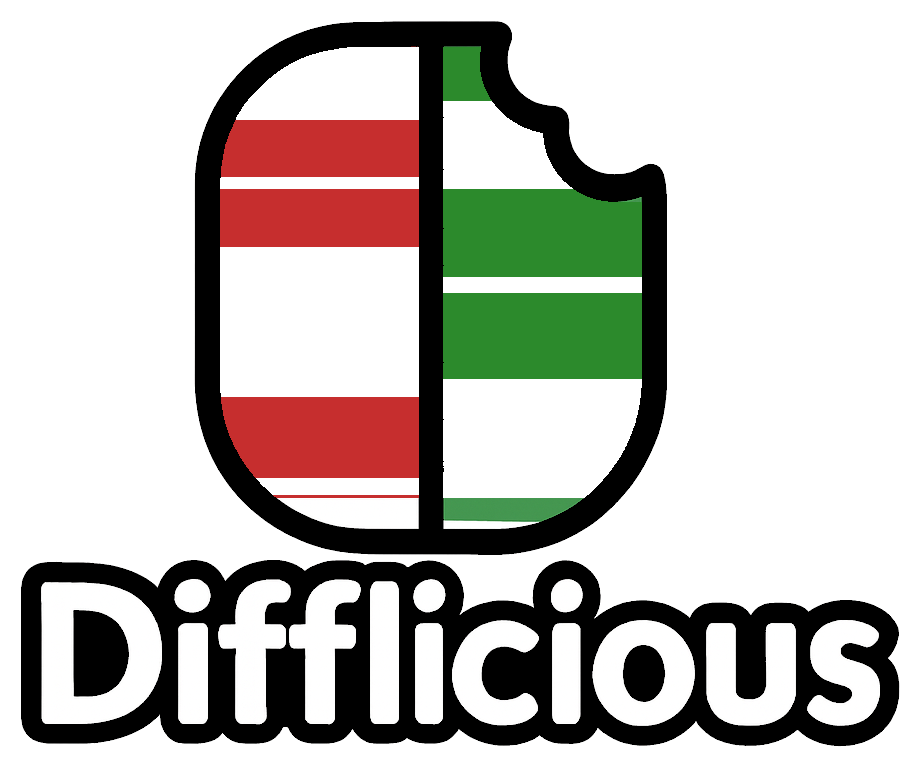
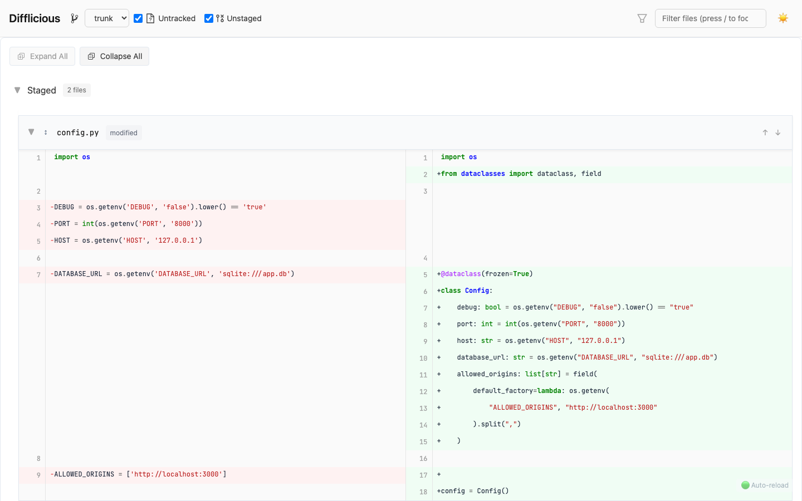
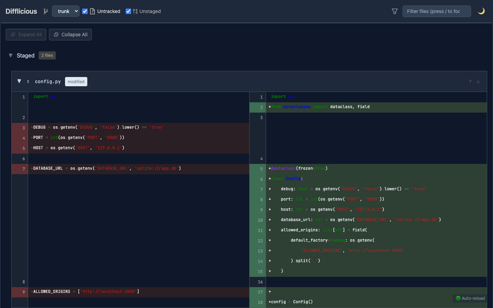

<div align="center">
  
  <h1>Difflicious</h1>
  <p>A local diff viewer for comparing your working directory to any branch, not just HEAD.<br>
  No forge, no push — just run it in your repo.</p>
</div>

---

## Screenshots

<p align="center">
  
  
</p>

## Usage

The quickest way — no install required:

```bash
uvx difflicious
```

Or with Docker:

```bash
docker run -it --rm -v "$PWD:/workspace" -p 5000:5000 insipid/difflicious
```

Then open `http://localhost:5000` in your browser.

## Installation

For regular use, install from PyPI:

```bash
pip install difflicious
difflicious
```

See [INSTALLATION.md](INSTALLATION.md) for Docker, source installation, and full configuration options.

## Features

- Side-by-side diff view with line numbering
- Syntax highlighting for 100+ languages (via Pygments)
- Context expansion to see more surrounding code
- Search and filter across files
- Light and dark themes
- Live auto-reload on file changes (SSE)
- Font customization via `DIFFLICIOUS_FONT` environment variable

## Configuration

Set environment variables to configure behaviour:

| Variable | Default | Description |
|----------|---------|-------------|
| `DIFFLICIOUS_PORT` | `5000` | Port to listen on |
| `DIFFLICIOUS_HOST` | `127.0.0.1` | Host to bind to |
| `DIFFLICIOUS_FONT` | `jetbrains-mono` | Code font (see `--list-fonts`) |
| `DIFFLICIOUS_DISABLE_GOOGLE_FONTS` | `false` | Use system fonts only |
| `DIFFLICIOUS_AUTO_RELOAD` | `true` | Auto-reload on file changes |
| `DIFFLICIOUS_DEBUG` | `false` | Verbose debug logging |

See [INSTALLATION.md](INSTALLATION.md) for full configuration details.

## Technology

- **Backend**: Flask, GitPython, Pygments, unidiff
- **Frontend**: Alpine.js, Tailwind CSS
- **Real-time**: Server-Sent Events

## Documentation

- [INSTALLATION.md](INSTALLATION.md) — installation options, configuration, environment variables
- [DEVELOPING.md](DEVELOPING.md) — development setup, testing, code conventions
- [CHANGELOG.md](CHANGELOG.md) — version history
- [docs/TROUBLESHOOTING.md](docs/TROUBLESHOOTING.md) — common issues

## Contributing

See [CONTRIBUTING.md](CONTRIBUTING.md).

---

[](https://pypi.org/project/difflicious/)
[](https://pypi.org/project/difflicious/)
[](https://opensource.org/licenses/MIT)
