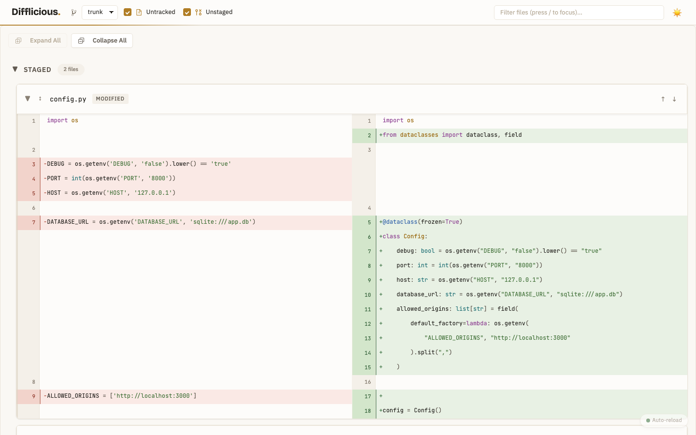
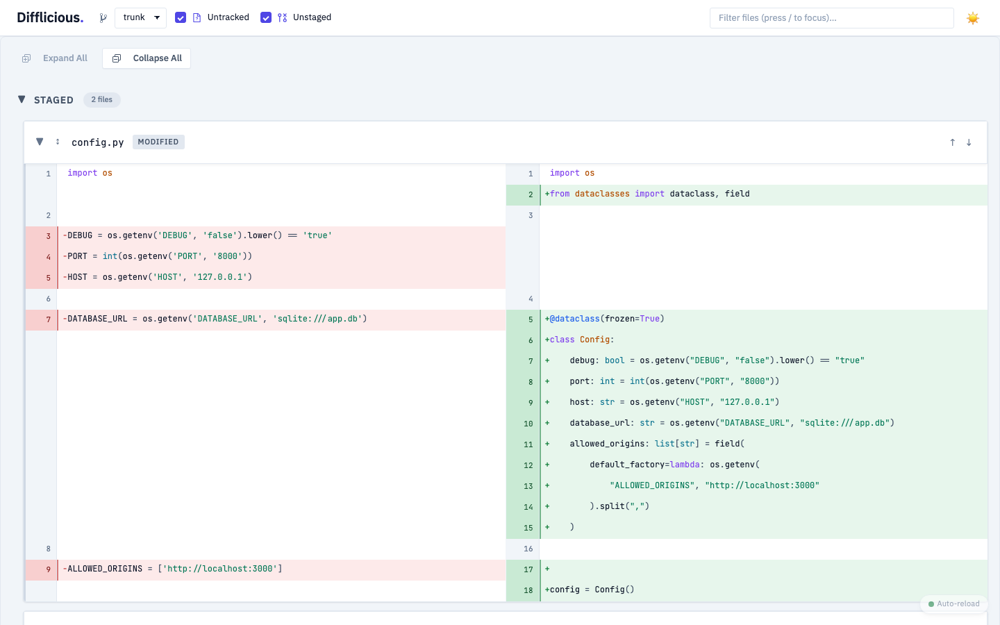
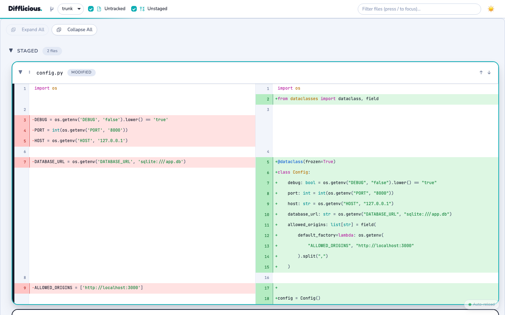
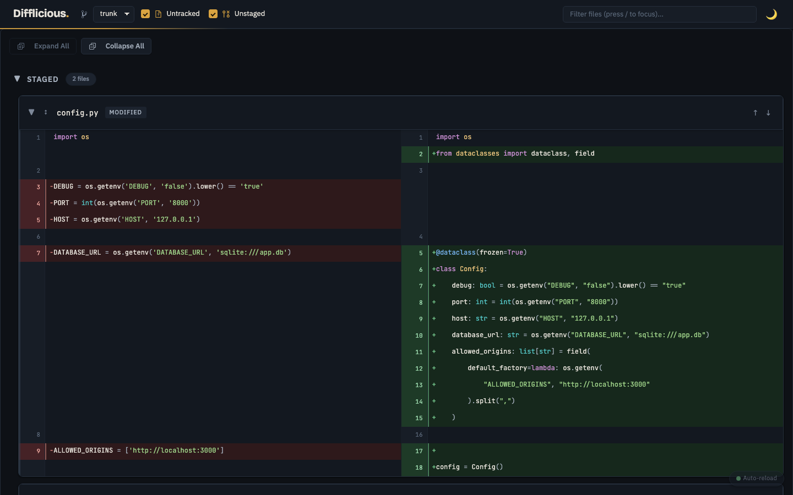
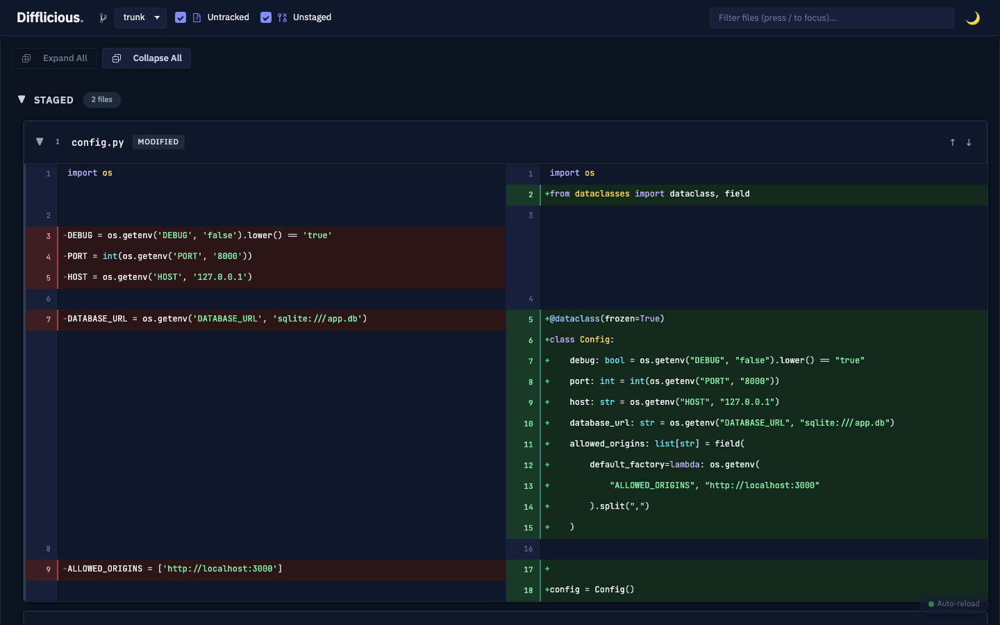
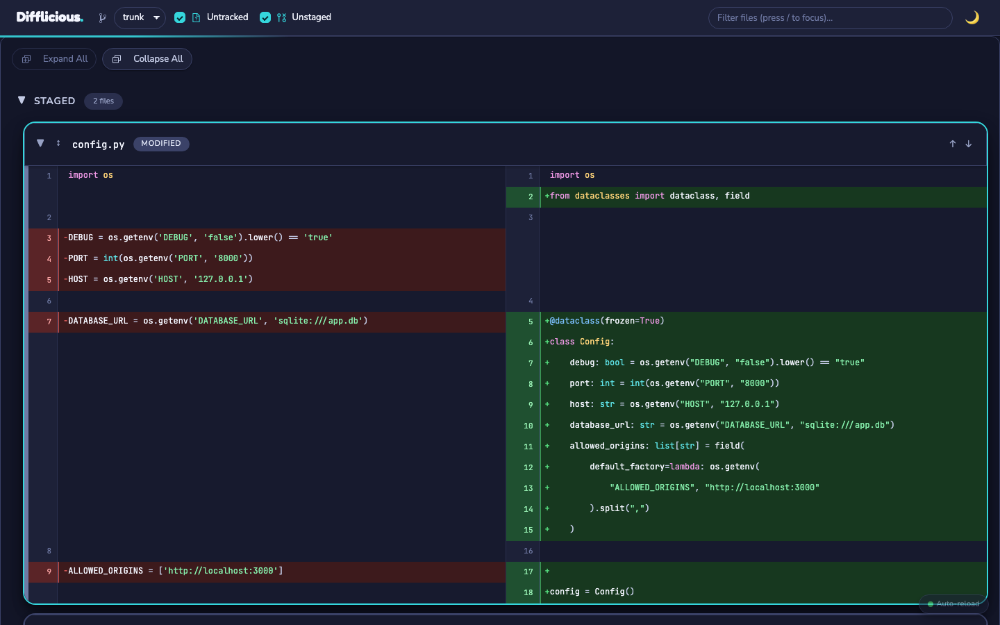

# Theming Difflicious

Difflicious ships several themes and picks one at startup. Every design decision
lives in the theme files under `src/difflicious/static/css/themes/`; no other
file may declare a literal colour, radius, or spacing value.

## Choosing a theme

```bash
difflicious --theme slate        # for one run
export DIFFLICIOUS_THEME=slate   # for the shell
difflicious --list-themes        # what is available
```

The default is `ledger`. An unknown name on the command line is rejected with the
valid options; an unknown name in the environment falls back to the default
rather than refusing to start, so a stale shell profile cannot break the tool.

| Theme | Look |
|---|---|
| `ledger` (default) | Warm paper and ink, single ochre accent |
| `slate` | Cool neutral greys, indigo accent, squarer and denser |
| `sorbet` | Bright and rounded, heavy outlines, turquoise accent |

### What they look like

Thumbnails — click any one for the full-size image.

| Ledger | Slate | Sorbet |
|:---:|:---:|:---:|
| <a href="screenshots/themes/ledger-light.png"></a> | <a href="screenshots/themes/slate-light.png"></a> | <a href="screenshots/themes/sorbet-light.png"></a> |
| <a href="screenshots/themes/ledger-dark.png"></a> | <a href="screenshots/themes/slate-dark.png"></a> | <a href="screenshots/themes/sorbet-dark.png"></a> |

Light on the top row, dark on the bottom. Every theme ships both; neither is a
filter over the other.

Regenerate them all after changing a theme:

```bash
uv run python scripts/screenshot.py --all-themes
```

### Bring your own stylesheet

A theme value that looks like a URL — anything starting `http://`, `https://`,
`//`, or ending in `.css` — is treated as a stylesheet reference rather than a
registry key, and the theme is named after the file:

```bash
difflicious --theme https://example.com/themes/midnight-neon.css   # → "Midnight Neon"
```

It still loads on top of `_contract.css`, so a custom stylesheet only has to
supply a palette. Fonts are not fetched on its behalf — declare `@import` or
`@font-face` inside the stylesheet if it needs them. Note that a remote URL means
the page makes an external request, which `DIFFLICIOUS_DISABLE_GOOGLE_FONTS` does
not cover.

## How the files fit together

Two stylesheets load, in this order:

```
themes/_contract.css   scales, density knobs, back-compat aliases  (always)
themes/<name>.css      palette + semantic roles                    (selected)
```

The contract holds what is theme-independent. A theme supplies the palette and
the roles built on it — and because it loads second, it may override anything in
the contract. `slate.css` does exactly that to get squarer corners and a
different display face, which is the intended way for a theme to change more
than colour.

Custom property resolution is lazy, so the aliases in the contract may reference
semantic tokens the theme has not declared yet. Order never matters.

## The rule

```
themes/*.css  →  declare tokens        (all design decisions)
styles.css    →  consumes tokens       (structure and layout only)
templates     →  use semantic classes  (never Tailwind colour utilities)
```

`styles.css` is checked for this: it contains zero hex colours. If you find
yourself typing `#` or a raw `px` radius into it, add a token instead.

## Token layers

Between them, the contract and a theme cover five sections.

| Section | What it holds | Edit it when |
|---|---|---|
| 1. Primitives | Space, radius, border-width, type, motion scales. Theme-independent. | Changing the rhythm of the whole UI |
| 2. Palette | Raw colour ramps, one set per theme (`--theme-paper-*`, `--theme-ink-*`, `--theme-accent-*`) | Changing the actual colours |
| 3. Semantic | Role aliases: `--surface-*`, `--text-*`, `--border-*`, `--accent-*`, `--diff-*` | Changing what a colour *means* |
| 4. Component | Density knobs: `--control-height`, `--file-card-accent-width`, `--diff-line-height`, `--toolbar-height` | Making things tighter, rounder, flatter |
| 5. Legacy | Back-compat aliases for older variable names | Rarely — these exist so the swap is non-breaking |

Components reference **semantic** and **component** tokens only. They never
reach past those into the palette, which is what makes a theme swap total.

## Common changes

**Different accent colour.** Edit the four `--theme-accent-*` values in the light
block and again in `[data-theme="dark"]`. Everything interactive follows:
checkboxes, focus rings, the toolbar rule, hunk expansion pills, the wordmark
full stop.

**Rounder or squarer.** Change `--radius-sm` / `--radius-md`, or the component
knobs `--control-radius` and `--file-card-radius`.

**Tighter or airier.** The space scale is a 4px grid (`--space-2xs` … `--space-4xl`).
For the diff body specifically, `--diff-line-height` and `--diff-gutter-width`.

**Different typefaces.** Set `--font-display` (wordmark) and `--font-ui`
(interface) in the theme, and give the theme a `google_fonts_url` in the registry
so its faces are fetched. Only the selected theme's fonts load, and only when
`DIFFLICIOUS_DISABLE_GOOGLE_FONTS` is not set. `--font-mono` comes from
`DIFFLICIOUS_FONT` at runtime and should not be hardcoded in a theme.

**A whole new theme.** Copy `themes/ledger.css`, change the values, and register
it in `AVAILABLE_THEMES` in `src/difflicious/config.py`:

```python
"midnight": {
    "name": "Midnight",
    "description": "What it looks like, in a few words",
    "file": "midnight.css",
},
```

`ledger.css` declares every token a theme is expected to supply, so starting from
a copy of it means nothing is missed. A test asserts that each registered theme's
stylesheet actually exists.

## Diff colours are reserved

Green and red belong to diff semantics and nothing else. The accent is
deliberately a hue far from both so it never reads as "added" or "removed".
Interface elements — badges, strips, buttons, states — take the accent or a
neutral. Keep it that way; it is the reason the diff stays readable.

## Syntax highlighting

Token colours are `--syntax-*` in `theme.css`. Pygments emits CSS classes and
`SyntaxHighlightingService.get_css_styles()` maps those classes onto the
variables, so highlighting follows the active theme like everything else.

Highlighting is rendered server-side once while the theme is switched in the
browser. That is why the formatter must stay class-based (`noclasses=False`) —
inline styles would bake one theme's colours into the markup and no stylesheet
could override them.

## Both themes, every time

Light and dark are peers, not a base and a filter. Every semantic token is
declared in both blocks of a theme file. Test both, for each theme:

```bash
DIFFLICIOUS_THEME=slate uv run python design-review/shoot.py <dir>
```

## A theme may change more than colour

Because a theme loads after the contract, it can override any token there.
`slate` uses this to be squarer; `sorbet` goes further — fatter radii, a real
outline on cards, pill-shaped controls, and its own rounded typeface. If a theme
only changes hex values, it will look like a repaint of Ledger.

Card edges have their own tokens (`--file-card-border-colour`,
`--file-card-border-colour-hover`) precisely so a theme can outline cards heavily
without making every control and divider heavy too.

## Watch out for

**Never reference another theme's private palette.** Tokens prefixed
`--theme-<something>-*` belong to the theme that declares them. The contract and
`styles.css` must only use semantic roles, which every theme declares. A rule
pointing at `--theme-paper-500` silently resolves to nothing under Slate or
Sorbet.

## Not yet built

The theme is fixed for the life of the server process. Still to come: a picker in
the UI that persists to `localStorage`, and per-request selection. The registry
in `config.py` is the seam those will extend.
