# Three theme proposals: more colour, more character

**Status:** proposals for review. All three are implemented and registered so they
can be run and screenshotted, but they are *candidates* — the intent is to keep
one or two and delete the rest before this lands.

```bash
difflicious --theme terrace
difflicious --theme draught
difflicious --theme riso
```

## Where the existing three sit

| Theme | Ground | Accent | Shape | Type |
|---|---|---|---|---|
| `ledger` | one warm neutral, cards near-white | ochre | 8px cards, hairline edges, soft shadow | Bricolage Grotesque |
| `slate` | one cool neutral, cards white | indigo | 5px cards, no toolbar rule | IBM Plex Sans |
| `sorbet` | bright cool, cards white | turquoise | 18px cards, 2px near-black outline, pill controls | Fredoka / Nunito |

The pattern all three share, and the one the proposals break: **a single neutral
ramp with white cards sitting on it.** Colour appears only in the accent and in
the diff tints. Sorbet already varies the geometry; none of them varies the
*surfaces*.

## What the proposals change

Each candidate gives the toolbar, the page, the cards and the line-number
gutters their own tint rather than four steps of one ramp. That is what makes the
palette read as coloured rather than as grey-with-an-accent, and it needed no new
tokens — `--surface-chrome` and `--diff-gutter-bg` were already separate roles,
just previously set to neighbouring values.

Each also picks a hue no shipped theme uses, so the five never blur together:
ochre, indigo, turquoise, then **kiln teal**, **mulberry**, **ultramarine**.

Green and red stay reserved for diff semantics in all three, per THEMING.md. The
mulberry in Draught is the closest call; it is violet-pink against a rust-red
deletion tint, and the two never appear on the same element.

---

## 1. Terrace — warm plaster, rounded, sunlit

Clay walls, cream panels, an ivory rail along the top, sand-tinted gutters, and a
blue-leaning teal running cool against all of it. The softest of the three:
18px cards, pill controls and badges, a 2px warm edge, wide soft shadows.
Fraunces over Karla — a serif wordmark, which no theme currently has.

Nearest relative is Ledger, and the point of difference is that Ledger is one
warm neutral while Terrace is four distinct warm tints plus a cool accent.

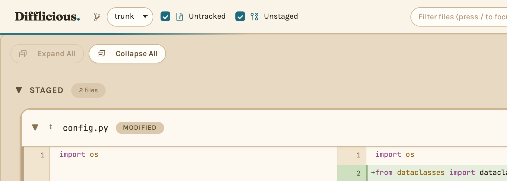
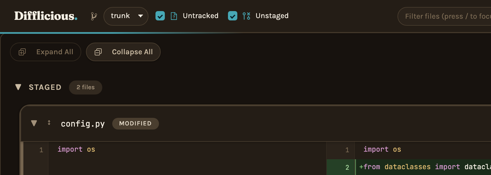
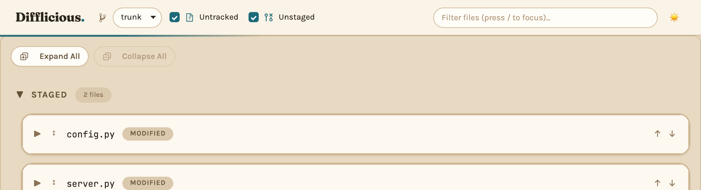
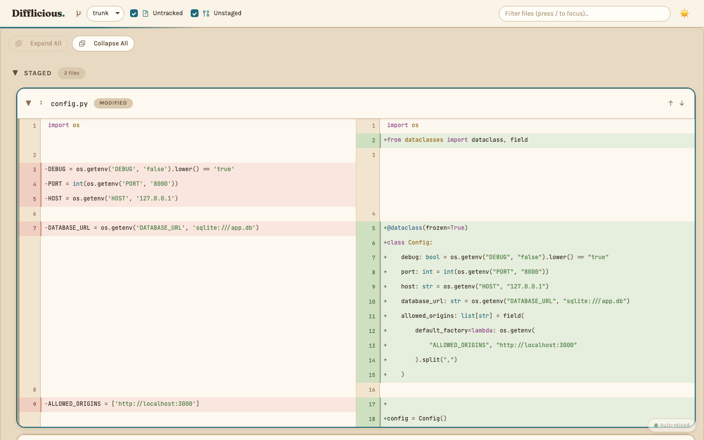
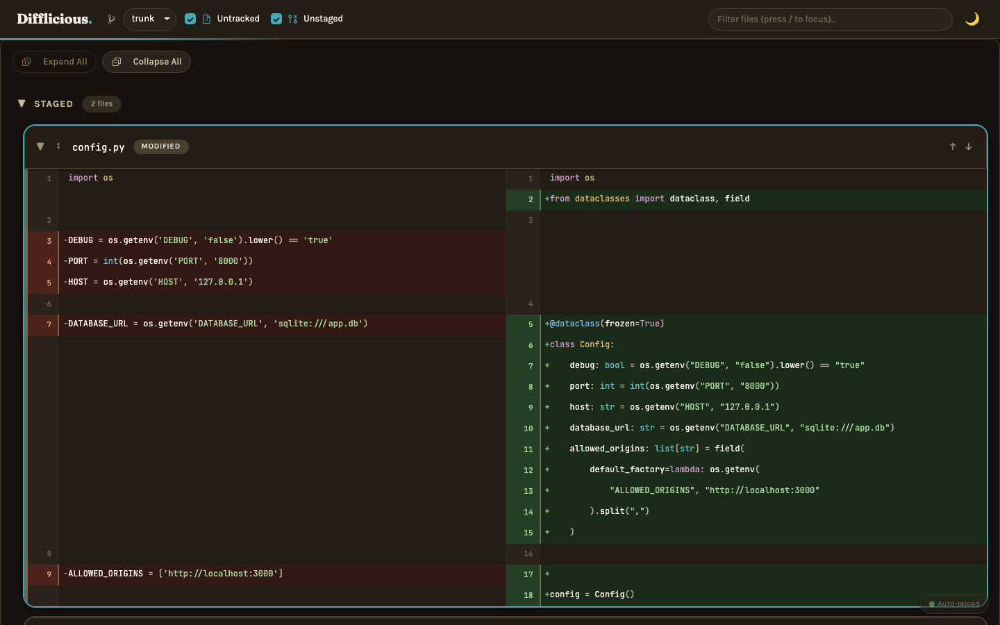

## 2. Draught — drafting board, squared off, ruled

A petrol-blue board with bone paper pinned to it and a steel rail across the top.
Character from structure rather than softness: 3px cards, 1px radius controls,
flat elevation (`0 1px 0`, paper lying on a board rather than floating above it),
wide letter-spacing on the small-caps labels, a taller diff line and a wider
number column so the body reads as ruled paper. Space Grotesk over Archivo.
The accent is mulberry — a warm note against a cool ground.

Densest of the three, and the one that most rewards a large diff. It is also the
one with the least colour; if it is the favourite, the board wants pushing
further towards petrol.

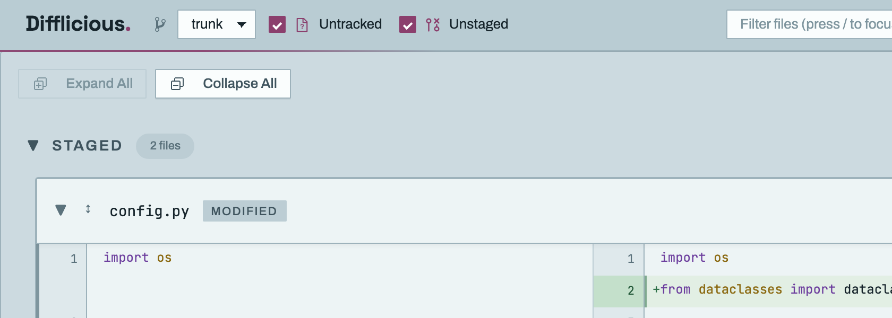
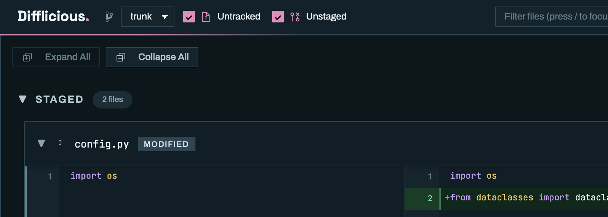
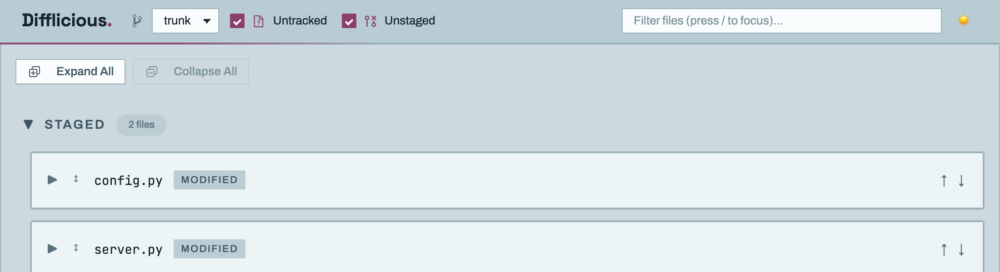
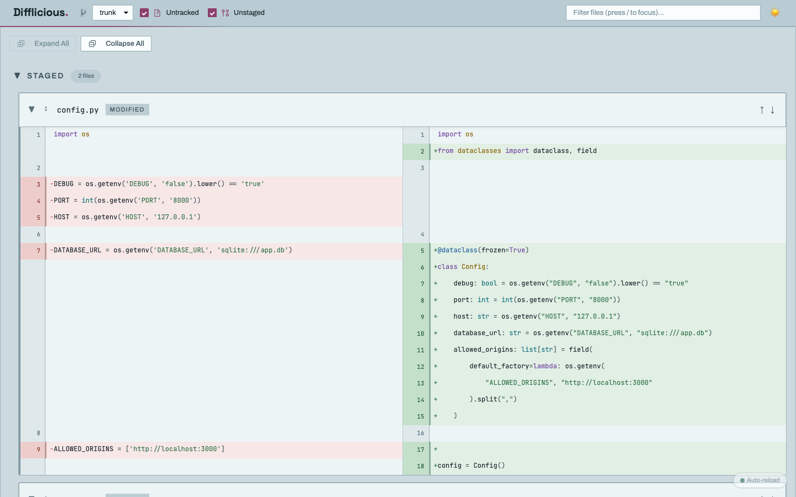
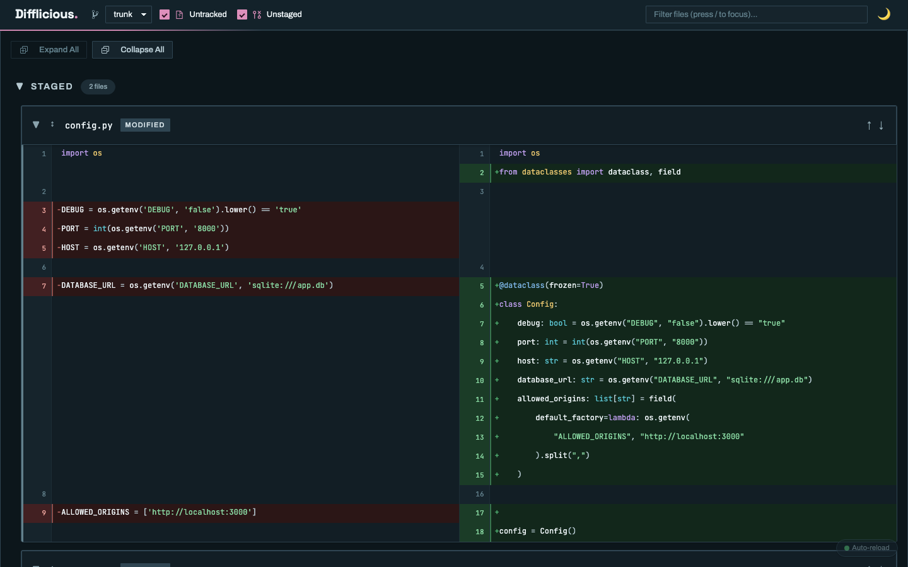

## 3. Riso — two-ink print, hard offset ink, slab type

A risograph print: dusty heather ground, cream stock over it, and a violet-black
ink used both for the card outline and for shadows with **no blur at all** —
`3px 3px 0`, the way a second pass of ink sits slightly off-register. That single
change to the shadow tokens is what makes every card read as a printed object
instead of a floating panel, and it is the most distinctive thing any of the
three does. Chunky 8px status strips, pill badges, ultramarine accent, Zilla Slab
over Work Sans.

The one caveat: in dark mode a near-black ink on a near-black ground erases the
outline, so the card edge steps up the ramp instead and the offset reads as
depth rather than as ink. Dark Riso is therefore a little less characterful than
light Riso.

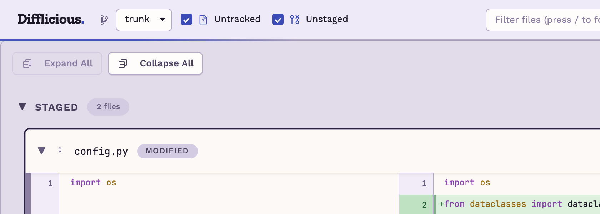
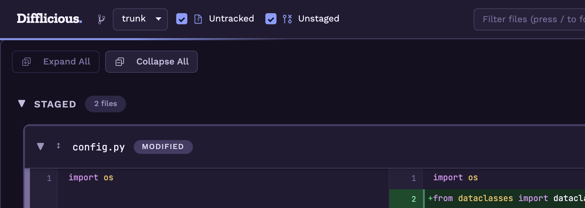
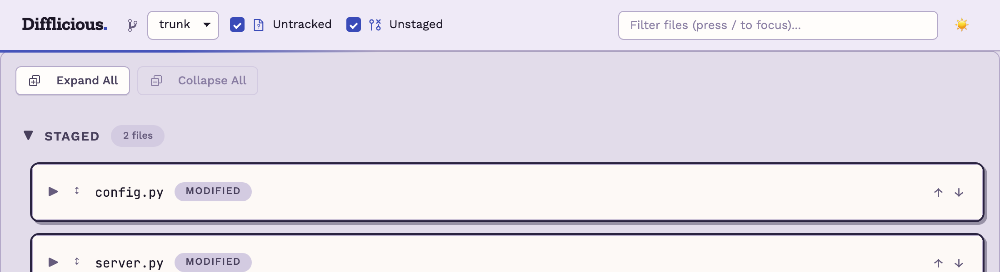
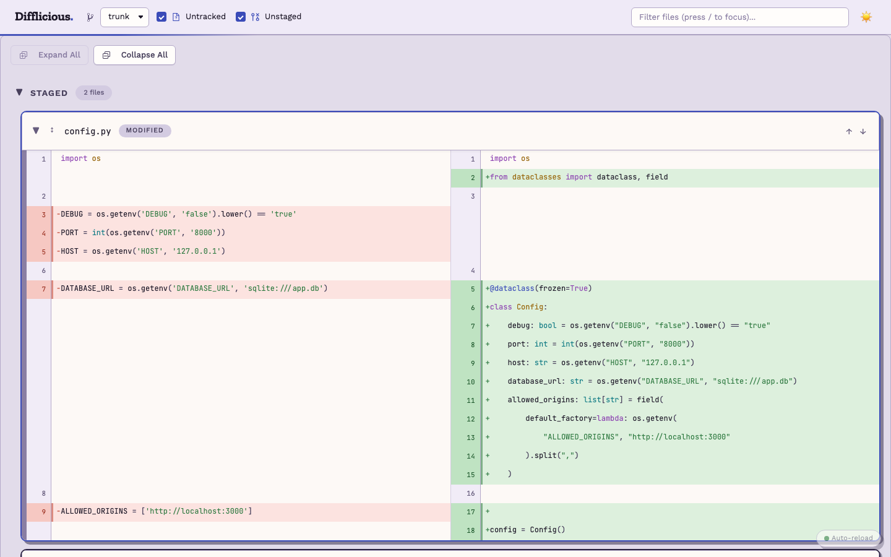
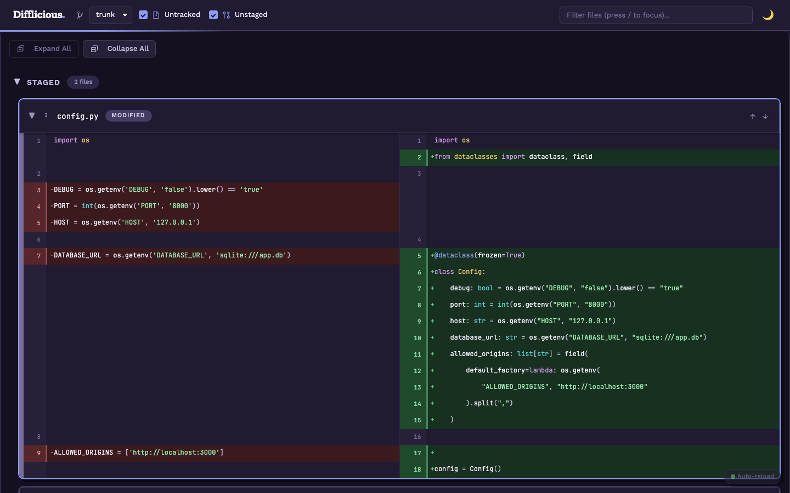

---

## Two fixes to the screenshot harness, made along the way

Both are in `scripts/screenshot.py` and are independent of which theme wins.

**Webfonts were never in their own screenshots.** Fonts load with
`display=swap`, and the script shot the page before they arrived, so every theme
screenshot in `docs/` shows the fallback face rather than the theme's own
typeface. Fixed by awaiting `document.fonts.ready` before capture. This means the
existing `docs/screenshots/themes/*.png` are stale and worth regenerating
whichever proposal is chosen.

**`--themes a,b,c`** captures a subset instead of all of them, so iterating on
one theme no longer means re-shooting every theme.

## If a proposal is adopted

1. Delete the two candidates that lost, from `themes/` and from
   `AVAILABLE_THEMES` in `src/difflicious/config.py`.
2. Drop the "candidates under review" comment block in `config.py`.
3. Add the winner to the table and thumbnail grid in `docs/THEMING.md`, and to
   the theme list in `CLAUDE.md` and `README.md`.
4. Regenerate `docs/screenshots/themes/` with
   `uv run python scripts/screenshot.py --all-themes` — now that fonts are
   awaited, every existing theme's shots change too.
5. Delete this file and `docs/screenshots/proposals/`.
